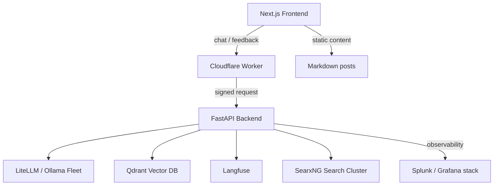
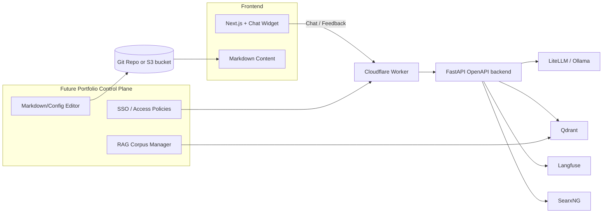

We finally shipped the experience I've wanted for years: a single site where anyone interested in my work can explore it *and* interrogate it with an AI that actually knows the details. This post is the quick tour, high level enough to keep trade secrets safe yet detailed enough to show we're serious.

## Why build this?

- **Security-first storytelling.** Most "AI agents" hallucinate as soon as you ask about real enterprise work. I wanted visitors to query my Splunk deployments, homelab clusters, and AI builds with confidence.
- **Customer-grade workflows.** Everything here mirrors how I help customers every day: architecture reviews, guided enablement, and tight feedback loops.
- **Future automation.** The entire front end is configurable (Markdown-driven content, Ask-AI hooks, and config files ready for a headless editor). When the API + control plane land, I won't be rewriting TSX.

### Deployment footprint (today)

- **Dev stack:** A homelab node dedicated to preview builds runs the Next.js app, FastAPI backend, Qdrant, Langfuse client, and the isolated SearxNG instance we use for augmentation.
- **Prod stack:** Another node handles the production Next.js image behind Traefik. Cloudflare Access + workers sit in front so every request is authenticated before the backend sees it.
- **Perimeter services:** Cloudflare owns DNS, SSL, Zero Trust, and Worker routing; Splunk + Langfuse capture observability data so regressions surface immediately.

This mirrors how I guide Splunk customers: Git commit → automated build → containerized deploy → observable runtime. No manual tinkering; every improvement is versioned.

## Architecture snapshot

### Highlights

| Layer | What it does |
| --- | --- |
| **Frontend** | Next.js + Tailwind, chat widget + `/chat` page, Markdown-driven About + posts, responsive layout tuned for dark mode. |
| **Worker Edge** | Cloudflare Worker signs every chat + feedback call (API key + Access token ready). Acts as the single ingress point. |
| **Backend** | FastAPI service with LiteLLM, RAG orchestration, rate limiting, feedback endpoint, and SearchNG augmentation for code blocks. |
| **Knowledge** | Qdrant collection with curated markdown docs + sanitized extracts (no customer data). |
| **Observability** | Langfuse for prompt/session traces, Splunk dashboards for infra signals, Traefik metrics for prod routing. |

## What the assistant actually knows

1. **Security & automation patterns** – All of the homelab blueprints, Zero Trust reference designs, SOAR prototypes, and defensive automation work I've published.
2. **Observability pipelines** – OpenTelemetry rollouts, Proxmox/K3s telemetry, GitOps-driven config, and the docs that support them.
3. **AI systems** – Langfuse instrumentation, LiteLLM routing, MCP servers, SearxNG enrichment, plus everything I've shared about building trustworthy RAG.

Each response carries:

- A bit of Aussie flair to keep things approachable without losing the professional tone.
- Source links back to public posts (from the new canonical domain) so readers can deep dive without hunting.
- A CTA to contact me, because real conversations beat static PDFs every day.

## How the chat workflow behaves

1. **Visitor question** hits `/api/chat` → Worker → Backend.
2. **Backend** validates the API key, enforces the security posture, and pulls:
   - Qdrant vectors (top 5 for general queries, 3 for code blocks).
   - SearchNG snippets when someone clicks "Ask AI" inside a blog code block.
3. **LiteLLM** composes a grounded answer.
4. **Langfuse** captures spans so I can see latency, failure modes, and user flows.
5. **Related links** + CTA appended.

Feedback (👍/👎) already posts to the new `/feedback` endpoint, and Langfuse has the traces ready for automated scoring.

### Interaction flow

1. **Visitor lands on the Next.js site** and either chats via the `/chat` page or presses “Ask AI” inside a code block.
2. **Chat widget hits the Cloudflare Worker**, which injects API keys + Access tokens and forwards the payload to FastAPI.
3. **FastAPI fans out** to Qdrant (portfolio memory), SearxNG (web lookup for code blocks), and LiteLLM/Ollama (generation). Every call is traced in Langfuse.
4. **Response assembly** adds Aussie-toned messaging, source links, CTA, and, when relevant, diagrams served from the S3-compatible bucket.
5. **Feedback** loops back through the Worker to FastAPI and straight into Langfuse/Splunk dashboards for follow-up.

## Implementation notes

I built this deployment the same way I would stand up a customer reference: multiple containers, reproducible compose files, and very little that needs manual tweaking once it is online. The Next.js app rides in its own image, Traefik terminates TLS on the edge nodes, and every service that holds state (Qdrant, Langfuse, SearchNG, Redis) runs in its own compose project so I can bump versions or apply Terraform changes without touching the public site.

### Backend control plane

- **FastAPI** is the policy brain. Every request hits the API key check, the Cloudflare Access token validation, a per-IP rate limiter, and a max-length guard before it is even allowed to search Qdrant. That means the backend behaves the same whether I am using the public Worker or hitting it locally through `curl`.
- **Document lifecycle** is deterministic: Markdown lives in Git, then flows through `ingestion/sanitize_docs.py` and `ingestion/vectorize_simple.py`. Each embedding payload stores the file name so I can tell Langfuse which document powered a specific answer.
- **Session discipline** keeps the model honest. Chat requests include `source` metadata (`chat`, `widget`, `code-block`) so the backend can tune how many chunks to pull, and every payload is logged to Splunk with the same IDs I see in Langfuse.

### Observability and telemetry

- Langfuse captures every span with custom dimensions like `augmentation=searchng` or `augmentation=none`, so I can measure whether the SearxNG branch is actually helping users decode code blocks.
- Splunk indexes Traefik, Worker, and FastAPI logs. When a user reports a “slow” answer, I can jump straight to the span ID, correlate it with Traefik latency, and decide if the bottleneck was embeddings, LiteLLM, or SearchNG.
- S3 is more than a static asset bucket. Every sanitized Markdown file, every exported Excalidraw canvas, and every architecture PNG lands there with versioning turned on so I can recreate an older dataset if I need to debug a Langfuse regression.

### Zero-trust guardrails

- Cloudflare Access fronts both the Worker and the FastAPI proxy. Even the internal Traefik route has to present the service token, which means the same containers can run on my laptop, homelab, or a cloud VPS without changing ACLs.
- Sanitization is enforced via CI. If `sanitize_docs.py` finds a private IP or an internal hostname, the build breaks before anything gets vectorized.
- Feedback goes through the same Worker route (`/api/feedback`), so there is a single audit trail for user input, model output, and any thumbs-up/thumbs-down signals that come back from the UI.

## What's next

- **CMS-ready configs.** Every chunk of hero text, sidebar metadata, and future navigation will live in the repo as Markdown/JSON so the Portfolio API can edit it safely.
- **OpenAPI backend.** The FastAPI service is being refactored to expose fully documented OpenAPI endpoints so future tooling (or customer demos) can integrate without reverse engineering.
- **Editor UI.** A Dockling/Docling-inspired interface will sit on top: edit Markdown pages, About content, navigation, and CTA text directly, backed by Git or S3 (still deciding which store offers the best portability).
- **RAG management console.** Upload docs, sanitize them, inspect embeddings, and trigger re-indexing from the same UI. Langfuse + Splunk dashboards will anchor the observability view.
- **Single sign-on.** Cloudflare Access, or customer-provided IdP, will secure the control plane so teams can collaborate safely.
- **Reusable template.** Once the API ships, other engineers will be able to fork this stack, point it at their own Markdown + Qdrant data, and have the whole experience online in under an hour.

If you're keen to see the system in action, or want a similar experience for your team, reach out. Happy to walk through the playbook, Splunk-style. 🤙
